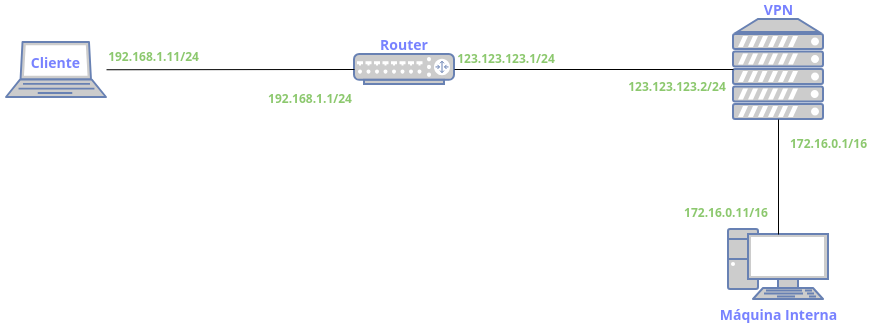

# TofuAnsibleVM



---

## Instalación QEMU/KVM

```bash
sudo apt install qemu-kvm libvirt-daemon-system libvirt-clients -y
sudo usermod -aG libvirt $USER
echo "export LIBVIRT_DEFAULT_URI='qemu:///system'" >> ~/.bashrc
source ~/.bashrc
```

---

## Instalación OpenTofu y Ansible

```bash
wget https://github.com/opentofu/opentofu/releases/download/v1.11.1/tofu_1.11.1_amd64.deb
sudo dpkg -i tofu_1.11.1_amd64.deb
rm tofu_1.11.1_amd64.deb
sudo apt install ansible -y
```

---

## Preparación qcow2

```bash
sudo wget -P /var/lib/libvirt/images/ https://cloud.debian.org/images/cloud/trixie/latest/debian-13-generic-amd64.qcow2
sudo qemu-img resize /var/lib/libvirt/images/debian-13-generic-amd64.qcow2 20G
```

---

## Creación del escenario

```bash
git clone https://github.com/f1rul4yx/TofuAnsibleVM.git
cd TofuAnsibleVM
./load-pub-key.sh
cd OpenTofu/
tofu init
tofu apply
```
